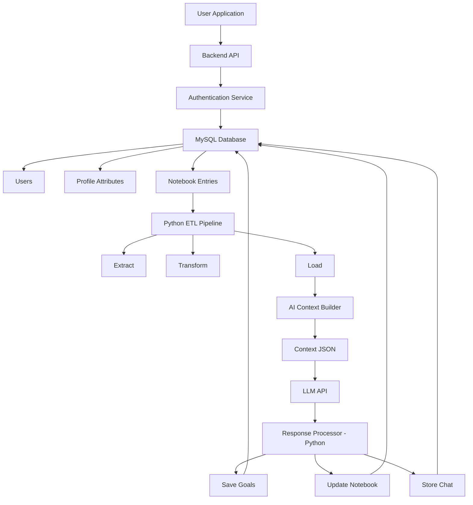

# System Architecture Report (Updated)

The following diagram illustrates the updated architecture of the AI assistant system, incorporating expanded backend processing and post-response management.

## Architectural Overview

## System Components

1.  **Application Layer**: Generic frontend supporting various interfaces.
2.  **Authentication & Data Layer**: Centralized API with MySQL for user and notebook data.
3.  **ETL & Context Layer**: Robust pipeline extracting notebook data to build structured context for AI.
4.  **Processing & Storage Layer**: LLM interaction followed by post-processing to update goals, notebooks, and chat history.
