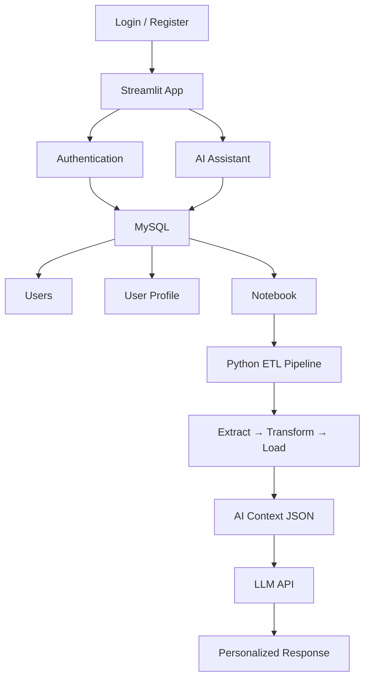

# System Architecture Report

The following diagram illustrates the architecture of the Streamlit-based AI assistant system.

## Architectural Overview

## System Components

1.  **Streamlit App**: The central web interface handling user interaction.
2.  **Authentication & AI Assistant**: Core modules managing session security and AI functionality.
3.  **MySQL Database**: Persistent storage layer holding user credentials, profiles, and notebook data.
4.  **ETL Pipeline**: Processes stored notebook data, transforming it into structured context for the AI.
5.  **LLM Integration**: Utilizes the prepared context to generate personalized responses.

The system is designed for modularity, separating data management from the AI processing layer to ensure consistent and personalized user interactions.
